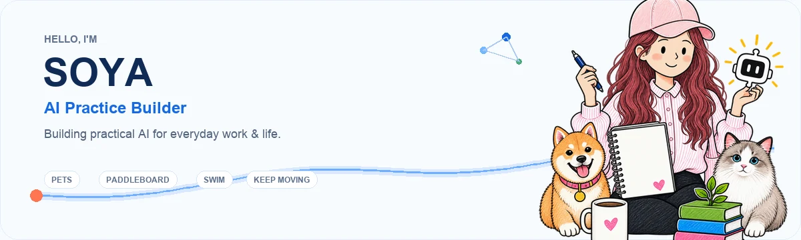

  

<h1 align="center">Hi, I'm SOYA 👋</h1>

  <strong>AI Practice Builder · AI 实践建造者</strong> 
  Building practical AI for everyday work &amp; life.

  探索 AI 如何成为非技术人的工作与生活方法。

---

## 关于我

**AI 实践建造者，现居中国杭州，在 Ant Group 从事产品运营。**

我探索 AI 如何成为非技术人的工作与生活方法：帮助人增强判断、推动执行，并把有效经验沉淀为可复用的工具与系统。

工作之外，我养了一只猫和一只狗，喜欢游泳和桨板等运动，也喜欢养植物。也在持续创造能为生活带来微小而美好的便利小产品。

如果你对我的开源项目有任何疑问，欢迎交流沟通：[soyoungzsy@foxmail.com](mailto:soyoungzsy@foxmail.com)。

## What I explore in AI

- **AI for non-technical work** — practical workflows for product operations, research, communication, and everyday decisions.
- **Human–AI collaboration** — task routing, evidence boundaries, waiting states, and verifiable completion, reflected in [AI Co-brain Workflow](https://github.com/soyoungzsy/ai-cobrain-workflow).
- **Knowledge that improves with use** — local-first systems that learn from decisions and feedback, reflected in [Self-enhancing Knowledge System](https://github.com/soyoungzsy/soya-self-enhancing-knowledge-system).
- **Small tools that change a real habit** — from immersive English reading with [SOYA LingoLens](https://github.com/soyoungzsy/soya-lingolens) to reflective decision-making with [SOYA Personal Board](https://github.com/soyoungzsy/soya).

## What I build

- **AI-native ways of working** — route work between humans and AI, keep evidence visible, and define what “done” actually means.
- **Self-enhancing knowledge systems** — turn notes, decisions, and feedback into a local-first system that keeps getting better.
- **Small products with real utility** — build focused tools for learning, reflection, and everyday life.

## My operating loop

> **Log** better inputs → **Orient** with evidence → **Operate** toward a verifiable result → **Preserve** what can compound.

I call this the **SOYA AI LOOP**: a practical way to make AI part of the work itself, while keeping human judgment in charge.

## Featured projects

<table>
  <tr>
    <td width="50%" valign="top">
      <h3><a href="https://github.com/soyoungzsy/ai-cobrain-workflow">AI Co-brain Workflow</a></h3>
      
An installable skill for routing tasks across humans, AI, collaborators, waiting triggers, and verifiable completion.

    </td>
    <td width="50%" valign="top">
      <h3><a href="https://github.com/soyoungzsy/soya-self-enhancing-knowledge-system">Self-enhancing Knowledge System</a></h3>
      
A local-first system for evidence governance, AI collaboration, knowledge maintenance, and continuous learning.

    </td>
  </tr>
  <tr>
    <td width="50%" valign="top">
      <h3><a href="https://github.com/soyoungzsy/soya">SOYA Personal Board</a></h3>
      
A private board of directors made of great minds—built for decisions, morning meetings, and long-term growth.

    </td>
    <td width="50%" valign="top">
      <h3><a href="https://github.com/soyoungzsy/soya-lingolens">SOYA LingoLens</a></h3>
      
A Chrome extension for immersive English reading: contextual translation, hover explanations, and lightweight review.

    </td>
  </tr>
</table>

## How I work

`Evidence before claims` · `Judgment before automation` · `Local-first by default` · `Useful enough to become a habit`

I share tools and methods that have survived real work—not just polished demos.

---

  <em>Build with judgment. Finish with evidence. Preserve what compounds.</em>

